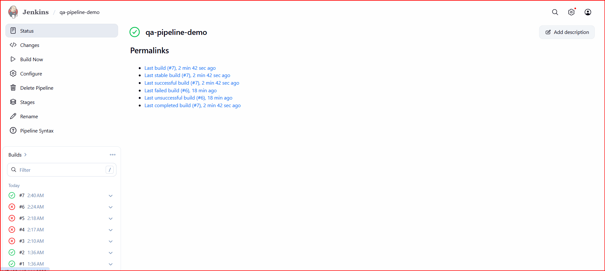
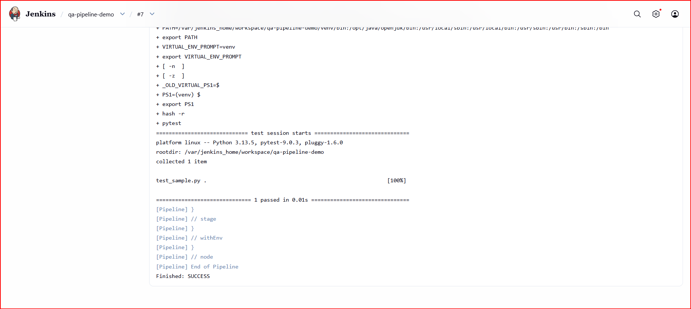

# Jenkins Docker QA Pipeline

Built a CI pipeline using Jenkins running on a DigitalOcean droplet with Docker. The pipeline pulls code from GitHub and runs Python tests using pytest.

## Tech Stack
- Jenkins
- Docker
- DigitalOcean (Cloud)
- Python
- pytest
- GitHub

## What this project does
- Deploys Jenkins on a cloud server using Docker
- Connects Jenkins to a GitHub repository
- Installs dependencies in a virtual environment
- Executes automated tests using pytest
- Displays test results in Jenkins console output

## Pipeline Stages
1. Checkout code from GitHub
2. Create Python virtual environment
3. Install dependencies
4. Run pytest test suite

## Sample Test Result
- 1 test executed
- Status: PASSED

## Screenshots

### Jenkins Pipeline Success

### Console Output

## How to run locally
pip install -r requirements.txt
pytest
