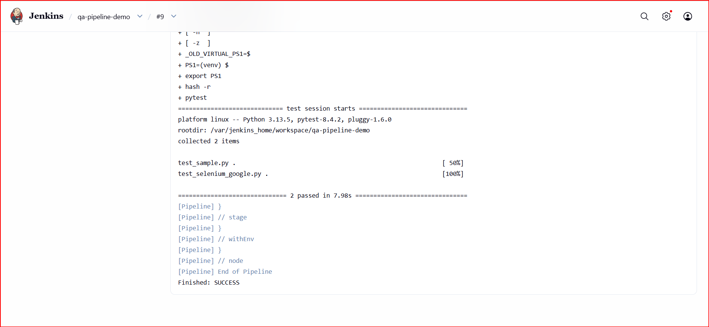

# Jenkins Docker QA Pipeline

Built a CI pipeline using Jenkins with Docker, Selenium, pytest, and MySQL tests on DigitalOcean

## Tech Stack
- Jenkins
- Docker
- DigitalOcean (Cloud)
- Python
- pytest
- Selenium
- Google Chrome
- GitHub

## What this project does
- Deploys Jenkins on a cloud server using Docker
- Connects Jenkins to a GitHub repository
- Builds a Docker image with Python, pytest, Selenium, and Chrome
- Executes automated browser tests using pytest
- Displays test results in Jenkins console output

## Pipeline Stages
1. Checkout code from GitHub
2. Build Docker test image
3. Run pytest test suite inside the container

## Test Results

- MySQL connection test: PASSED
- Pytest sample test: PASSED
- Selenium headless browser test: PASSED
- Pipeline Status: SUCCESS

## Screenshots

### Jenkins Pipeline Success


### Console Output



## How to run locally
Install dependencies and run tests directly:

```bash
pip install -r requirements.txt
pytest
```

Or run the same Docker flow used by Jenkins:

```bash
docker build -t jenkins-docker-qa-pipeline .
docker run --rm jenkins-docker-qa-pipeline
```
